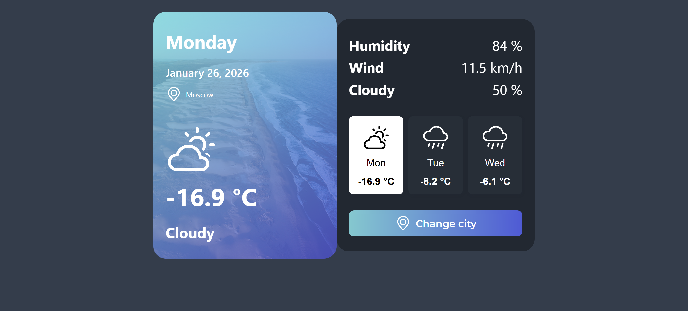

# Weather App

A weather application built with Vue.js and TypeScript.

## Preview



## Technologies

- **Vue.js**
- **TypeScript**
- **Vite**
- **CSS**

## Architecture

```
src/
├── App.vue                 # Main application component
├── constants.ts           # Application constants
├── main.ts                # Application entry point
├── assets/                # Static assets
│   ├── base.css           # Base styles
│   └── main.css           # Main styles
│
├── components/            # Reusable components
│   ├── Button.vue         # Button component
│   ├── CitySelect.vue     # City selection component
│   ├── DayCard.vue        # Weather day card component
│   ├── Error.vue          # Error display component
│   ├── Input.vue          # Input field component
│   ├── LeftPanel.vue      # Left panel layout
│   ├── RightPanel.vue     # Right panel layout
│   ├── Statistic.vue      # Weather statistics component
│   └── icons/             # Icon components
│       ├── IconCloud.vue  # Cloud icon
│       ├── IconLocation.vue # Location icon
│       ├── IconRain.vue   # Rain icon
│       └── IconSun.vue    # Sun icon
```

## Development

```bash
# Install dependencies
yarn install

# Start development server
yarn dev

# Build the project
yarn build

# Preview the build
yarn preview

# Run type-checking
yarn type-check

# Run linter
yarn lint

# Format code
yarn format
```
